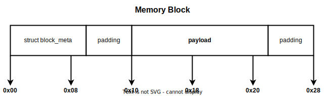

# Memory Allocator

## Objectives

- Learn the basics of memory management by implementing minimal versions of `malloc()`, `calloc()`, `realloc()`, and `free()`.
- Accommodate with the memory management syscalls in Linux: `brk()`, `mmap()`, and `munmap()`.
- Understand the bottlenecks of memory allocation and how to reduce them.

## Statement

Build a minimalistic memory allocator that can be used to manually manage virtual memory.
The goal is to have a reliable library that accounts for explicit allocation, reallocation, and initialization of memory.


## API

1. `void *os_malloc(size_t size)`

   Allocates `size` bytes and returns a pointer to the allocated memory.

   Chunks of memory smaller than `MMAP_THRESHOLD` are allocated with `brk()`.
   Bigger chunks are allocated using `mmap()`.
   The memory is uninitialized.

   - Passing `0` as `size` will return `NULL`.

1. `void *os_calloc(size_t nmemb, size_t size)`

   Allocates memory for an array of `nmemb` elements of `size` bytes each and returns a pointer to the allocated memory.

   Chunks of memory smaller than [`page_size`](https://man7.org/linux/man-pages/man2/getpagesize.2.html) are allocated with `brk()`.
   Bigger chunks are allocated using `mmap()`.
   The memory is set to zero.

   - Passing `0` as `nmemb` or `size` will return `NULL`.

1. `void *os_realloc(void *ptr, size_t size)`

   Changes the size of the memory block pointed to by `ptr` to `size` bytes.
   If the size is smaller than the previously allocated size, the memory block will be truncated.

   If `ptr` points to a block on heap, `os_realloc()` will first try to expand the block, rather than moving it.
   Otherwise, the block will be reallocated and its contents copied.

   When attempting to expand a block followed by multiple free blocks, `os_realloc()` will coalesce them one at a time and verify the condition for each.
   Blocks will remain coalesced even if the resulting block will not be big enough for the new size.

   Calling `os_realloc()` on a block that has `STATUS_FREE` should return `NULL`.
   This is a measure to prevent undefined behavior and make the implementation robust, it should not be considered a valid use case of `os_realloc()`.

   - Passing `NULL` as `ptr` will have the same effect as `os_malloc(size)`.
   - Passing `0` as `size` will have the same effect as `os_free(ptr)`.

1. `void os_free(void *ptr)`

   Frees memory previously allocated by `os_malloc()`, `os_calloc()` or `os_realloc()`.

   `os_free()` will not return memory from the heap to the OS by calling `brk()`, but rather mark it as free and reuse it in future allocations.
   In the case of mapped memory blocks, `os_free()` will call `munmap()`.

1. General

   - Allocations that increase the heap size will only expand the last block if it is free.
   - It is allowed to use `sbrk()` instead of `brk()`, in view of the fact that [on Linux](https://man7.org/linux/man-pages/man2/brk.2.html#NOTES) `sbrk()` is implemented using the `brk()`.
   - Do **NOT** use [`mremap()`](https://man7.org/linux/man-pages/man2/mremap.2.html)
   - Must check the error code returned by every syscall.
   Can use the `DIE()` macro for this.

## Implementation

An efficient implementation must keep data aligned, keep track of memory blocks and reuse freed blocks.
This can be further improved by reducing the number of syscalls and block operations.

### [Memory Alignment](https://stackoverflow.com/a/381368)

Allocated memory should be aligned (i.e. all addresses are multiple of a given size).
This is a space-time trade-off because memory blocks are padded so each can be read in one transaction.
It also allows for atomicity when interacting with a block of memory.

All memory allocations should be aligned to **8 bytes** as required by 64 bit systems.

### Block Reuse

#### `struct block_meta`

We will consider a **block** to be a continuous zone of memory, allocated and managed by our implementation.
The structure `block_meta` will be used to manage the metadata of a block.
Each allocated zone will comprise of a `block_meta` structure placed at the start, followed by data (**payload**).
For all functions, the returned address will be that of the **payload** (not of the `block_meta` structure).

```C
struct block_meta {
	size_t size;
	int status;
	struct block_meta *prev;
	struct block_meta *next;
};
```

_Note_: Both the `struct block_meta` and the **payload** of a block should be aligned to **8 bytes**.

_Note_: Most compilers will automatically pad the structure, but you should still align it for portability.



#### Split Block

Reusing memory blocks improves the allocator's performance, but might lead to [Internal Memory Fragmentation](https://www.tutorialspoint.com/difference-between-internal-fragmentation-and-external-fragmentation#:~:text=What%20is%20Internal%20Fragmentation%3F).
This happens when we allocate a size smaller than all available free blocks.
If we use one larger block the remaining size of that block will be wasted since it cannot be used for another allocation.

To avoid this, a block should be truncated to the required size and the remaining bytes should be used to create a new free block.


The resulting free block should be reusable.
The split will not be performed if the remaining size (after reserving space for `block_meta` structure and payload) is not big enough to fit another block (`block_meta` structure and at least **1 byte** of usable memory).

_Note_: Do not forget the alignment!

#### Coalesce Blocks

There are cases when there is enough free memory for an allocation, but it is spread across multiple blocks that cannot be used.
This is called [External Memory Fragmentation](https://www.tutorialspoint.com/difference-between-internal-fragmentation-and-external-fragmentation#:~:text=What%20is%20External%20Fragmentation%3F).

One technique to reduce external memory fragmentation is **block coalescing** which implies merging adjacent free blocks to form a contiguous chunk.


Coalescing will be used before searching for a block and in `os_realloc()` to expand the current block when possible.

_Note_: You might still need to split the block after coalesce.

#### Find Best Block

Our aim is to reuse a free block with a size closer to what we need in order to reduce the number of future operations on it.
This strategy is called **find best**.
On every allocation we need to search the whole list of blocks and choose the best fitting free block.

In practice, it also uses a list of free blocks to avoid parsing all blocks, but this is out of the scope of the assignment.

_Note_: For consistent results, coalesce all adjacent free blocks before searching.

### Heap Preallocation

Heap is used in most modern programs.
This hints at the possibility of preallocating a relatively big chunk of memory (i.e. **128 kilobytes**) when the heap is used for the first time.
This reduces the number of future `brk()` syscalls.

For example, if we try to allocate 1000 bytes we should first allocate a block of 128 kilobytes and then split it.
On future small allocations, we should proceed to split the preallocated chunk.

_Note_: Heap preallocation happens only once.

